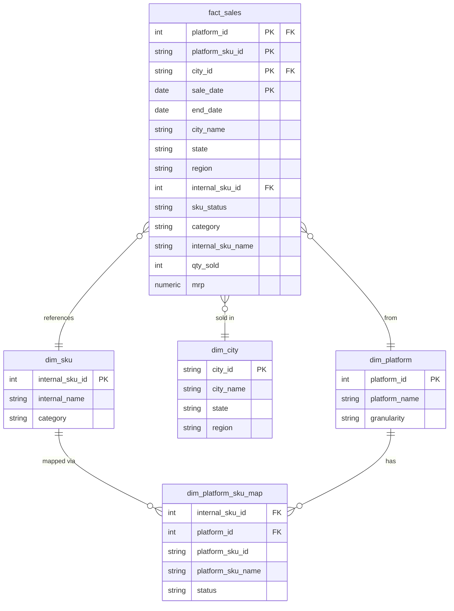

# Q-Commerce Sales Data Pipeline — Jaldhara Drinks

An end-to-end data engineering project simulating a real-world q-commerce analytics pipeline for a summer beverage brand (**Jaldhara**) across 5 major quick-commerce platforms in India.

The pipeline is designed to be **run daily** — re-executing the cleaning script automatically refreshes the database with the latest data, keeping dashboards and reports always up to date without any manual intervention.

---

## What This Project Does

Raw sales dumps from 5 platforms arrive in different formats, with inconsistent city names, platform-specific SKU IDs, and varying date granularities. This pipeline:

1. **Cleans** each platform's raw dump into a standardised format
2. **Maps** platform-specific SKU IDs to internal SKU IDs using a master mapping file
3. **Maps** raw city strings to standardised city names with a hierarchical city ID (Region → State → City)
4. **Loads** everything into a single unified MySQL fact table
5. **Updates automatically** — just re-run the script and the database reflects the latest data

---

## Platforms Covered

| Platform | Granularity | Identifier Format |
|---|---|---|
| Blinkit | Daily | Integer |
| Zepto | Daily | UUID |
| Instamart | Daily | Integer |
| FK Minutes | Daily | Alphanumeric string |
| BigBasket | Weekly / Monthly | Integer |

---

## Database Schema

The database follows a **star schema** — a single fact table at the centre, surrounded by dimension tables. This makes cross-platform aggregations fast and keeps the data model clean.



**Why composite primary key on `fact_sales`?** The combination of `platform_id + platform_sku_id + city_id + sale_date` uniquely identifies every row. No surrogate key needed — and duplicate inserts are automatically rejected by the database.

---

## Tech Stack

| Layer | Tool |
|---|---|
| Language | Python 3.11 |
| Data Manipulation | pandas, NumPy |
| Database | MySQL 8 |
| ORM / Connector | SQLAlchemy + PyMySQL |
| Notebooks | Jupyter |
| File Formats | CSV, XLSX |

---

## Key Engineering Decisions

**Single fact table across all platforms** — rather than separate tables per platform, all sales land in one `fact_sales` table with a `platform_id` column. Cross-platform queries become trivial `GROUP BY` operations instead of painful `UNION` chains.

**Composite primary key as deduplication** — re-running the pipeline with `if_exists="replace"` safely refreshes data. Switching to `if_exists="append"` with an `INSERT IGNORE` strategy enables true incremental daily loads.

**City master with hierarchical IDs** — every city gets a 7-digit ID (`RRSSCCCC`) encoding Region, State, and City. This lets you query `GROUP BY region` or `GROUP BY state` on the fact table directly without any joins.

**Platform-agnostic SKU mapping** — a single `dim_platform_sku_map` table maps every platform's external SKU ID to an internal ID. Updating one row here cascades to all reports automatically.

**Synthetic data generation** — because real company data cannot be shared publicly, a realistic synthetic dataset was generated for Jaldhara, a fictional summer beverage brand. Seasonal demand curves were modelled based on real q-commerce patterns — peak in May-June, monsoon dip in July-August, winter trough in December-January.

---

## How the Daily Update Works

```
Run data_cleaning.py
        │
        ▼
Reads raw CSVs from platforms
        │
        ▼
Cleans + standardises each platform df
        │
        ▼
Merges with SKU mapping → resolves internal_sku_id
        │
        ▼
Merges with city mapping → resolves city_id
        │
        ▼
Pushes to MySQL (replace / append)
        │
        ▼
Dashboard / reports auto-refresh from DB
```

---

## Dataset

The dataset covers **Jaldhara Drinks Pvt. Ltd.**, a fictional Indian summer beverage brand selling lemonade mixes, electrolyte drinks, sherbets, iced drink premixes, and snacks across q-commerce platforms.

- ~130,000 synthetic sales rows across 5 platforms
- Date range: February 2024 – September 2025
- 20 cities, 5 regions, 50+ SKUs
- Realistic seasonal demand trends (summer peak, monsoon dip, winter low)
- Includes Live, Not-Live, and Discontinued SKU statuses

---

## Sample Queries

**Total units sold per platform, FY 2024-25**
```sql
SELECT p.platform_name, SUM(f.qty_sold) AS total_units
FROM fact_sales f
JOIN dim_platform p ON f.platform_id = p.platform_id
WHERE f.sale_date BETWEEN '2024-04-01' AND '2025-03-31'
GROUP BY p.platform_name
ORDER BY total_units DESC;
```

**Top 5 SKUs by revenue in peak summer (Apr–Jun 2024)**
```sql
SELECT f.internal_sku_name, f.category, SUM(f.mrp) AS total_revenue
FROM fact_sales f
WHERE MONTH(f.sale_date) IN (4, 5, 6) AND YEAR(f.sale_date) = 2024
GROUP BY f.internal_sku_name, f.category
ORDER BY total_revenue DESC
LIMIT 5;
```

**City-wise sales with region breakdown**
```sql
SELECT f.region, f.state, f.city_name, SUM(f.qty_sold) AS units
FROM fact_sales f
GROUP BY f.region, f.state, f.city_name
ORDER BY f.region, units DESC;
```

---

## Author

**Akshay Bisht**  
[LinkedIn](https://linkedin.com/in/yourprofile) · [GitHub](https://github.com/yourusername)