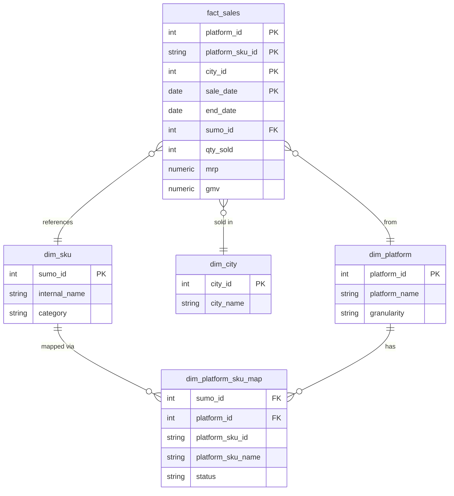

# E-Automation

```mermaid
erDiagram
  dim_sku {
    int sumo_id PK
    string internal_name
    string category
  }
  dim_city {
    int city_id PK
    string city_name
  }
  dim_platform {
    int platform_id PK
    string platform_name
    string granularity
  }
  dim_platform_sku_map {
    int sumo_id FK
    int platform_id FK
    string platform_sku_id
    string platform_sku_name
    string status
  }
  fact_sales {
    int platform_id PK
    string platform_sku_id PK
    int city_id PK
    date sale_date PK
    date end_date
    int sumo_id FK
    int qty_sold
    numeric mrp
    numeric gmv
  }
  dim_sku ||--o{ dim_platform_sku_map : "mapped via"
  dim_platform ||--o{ dim_platform_sku_map : "has"
  fact_sales }o--|| dim_sku : "references"
  fact_sales }o--|| dim_city : "sold in"
  fact_sales }o--|| dim_platform : "from"
```